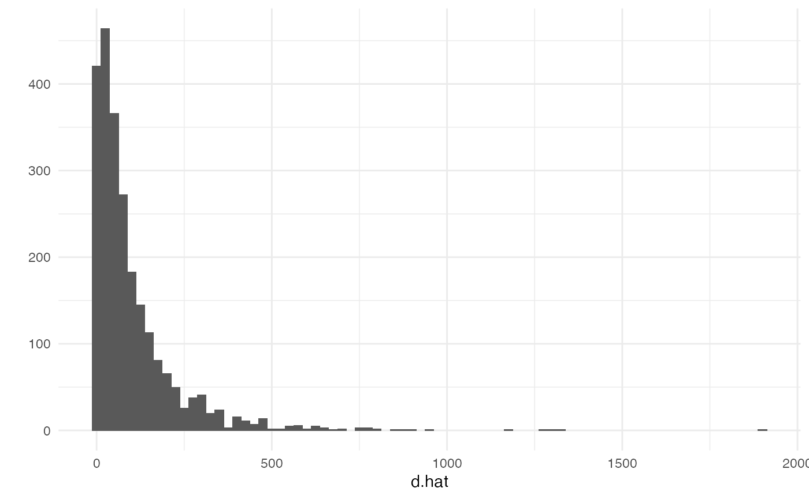
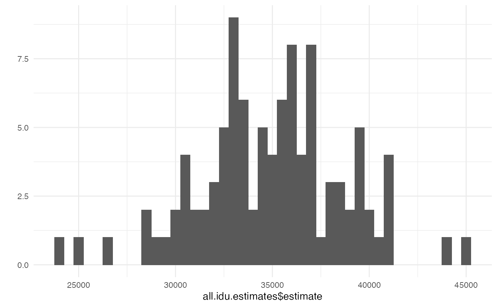
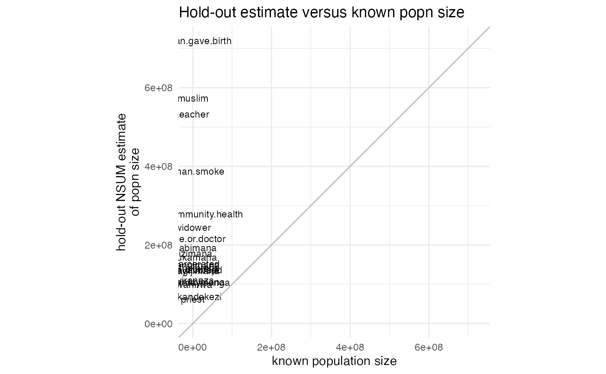
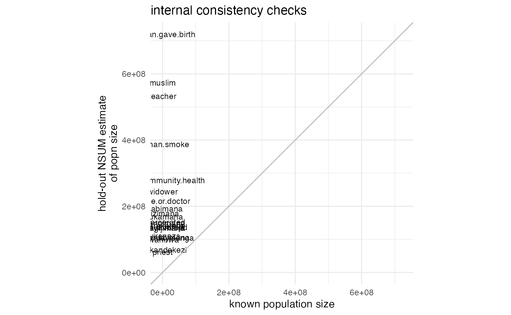

# Analyzing network scale-up data using the networkreporting package

## Introduction

The **networkreporting** package has several tools for analyzing survey
data that have been collected using the network scale-up method.

This introduction will assume that you already have the
**networkreporting** package installed. If you don’t, please refer to
the introductory vignette (“getting started”) for instructions on how to
do this.

## Review of the network scale-up method

For the purposes of this vignette, we’ll assume that you have conducted
a survey using network scale-up questions in order to estimate the size
of a hidden population. Analytically, using the scale-up estimator
involves two steps:

- step 1: estimating the size of the survey respondents’ personal
  networks (their *degrees*)
- step 2: estimating the size of the hidden population by combining the
  estimated network sizes (from step 1) with the number of connections
  to the hidden population

We’ll quickly review each of these steps, and then we’ll show how to use
the package to carry the estimation out.

### Step 1: estimating network sizes

Here, we will use the *known population* estimator for respondents’
degrees (Killworth et al., 1998; Feehan and Salganik, 2016). In order to
estimate the degree of the $`i`$ th survey respondent, we use

``` math

\begin{align}
\label{eqn:kpdegree}
\hat{d_i} = \sum_{j=1}^{K} y_{ij} \times 
\frac{N}{\sum_{j=1}^{K} N_j},
\end{align}
```

where $`N`$ is the total size of the population, $`N_j`$ is the size of
the $`j`$ th population of known size, and $`y_{ij}`$ is the number of
connections that survey respondent $`i`$ reports between herself and
members of the $`j`$ th population of known size.

### Step 2: estimating hidden population sizes

Once we have the estimates of the respondents’ degrees, we use them to
produce an estimate for the size of the hidden population:

``` math

\begin{align}
\label{eqn:nsum}
\hat{N}_h = \frac{ \sum_{i \in s} y_{ih} }{ \sum_{i \in s} \hat{d_i} },
\end{align}
```

where $`N_h`$ is the size of the population of interest (which we want
to estimate), $`s`$ is the set of respondents in our sample, and
$`\hat{d_i}`$ is the estimate of the size of respondent $`i`$’s degree,
obtained using the known population method.

## Preparing data

In order to use the package, we will assume that you start with two
datasets: the first is a survey containing information collected from
respondents about their personal networks; the second is information
about the sizes of several populations.

The example data for this vignette are provided with the
`networkreporting` package, and can be loaded by typing

``` r
library(networkreporting)
library(surveybootstrap)

## column names for connections to hidden population numbers
hidden.q <- c("sex.workers", "msm", "idu", "clients")

## column names for connections to groups of known size
hm.q <- c("widower", "nurse.or.doctor", "male.community.health", "teacher", 
          "woman.smoke", "priest", "civil.servant", "woman.gave.birth", 
          "muslim", "incarcerated", "judge", "man.divorced", "treatedfortb", 
          "nsengimana", "murekatete", "twahirwa", "mukandekezi", "nsabimana", 
          "mukamana", "ndayambaje", "nyiraneza", "bizimana", "nyirahabimana", 
          "ndagijimana", "mukandayisenga", "died")

## size of the entire population
tot.pop.size <- 10718378
```

The example data include two datasets: one has all of the responses from
a network scale-up survey, and the other has the known population sizes
for use with the known population estimator.

### Preparing the known population data

The demo known population data are in `example.knownpop.dat`:

``` r
example.knownpop.dat
```

    ##               known.popn   size
    ## 1                widower  36147
    ## 2        nurse.or.doctor   7807
    ## 3  male.community.health  22000
    ## 4                teacher  47745
    ## 5            woman.smoke 119438
    ## 6                 priest   1004
    ## 7       woman.gave.birth 256164
    ## 8                 muslim 195449
    ## 9           incarcerated  68000
    ## 10          man.divorced  50698
    ## 11            nsengimana  32528
    ## 12            murekatete  30531
    ## 13              twahirwa  10420
    ## 14           mukandekezi  10520
    ## 15             nsabimana  48560
    ## 16              mukamana  51449
    ## 17            ndayambaje  22724
    ## 18             nyiraneza  21705
    ## 19              bizimana  38497
    ## 20         nyirahabimana  42727
    ## 21           ndagijimana  37375
    ## 22        mukandayisenga  35055

`example.knownpop.dat` is very simple: one column has a name for each
known population, and the other has its toal size. We expect that users
will typically start with a small dataset like this one. When using the
`networkreporting` package, it is more useful to have a vector whose
entries are known population sizes and whose names are the known
population names. The `df.to.kpvec` function makes it easy for us to
create it:

``` r
kp.vec <- df.to.kpvec(example.knownpop.dat, kp.var="known.popn", kp.value="size")

kp.vec
```

    ##               widower       nurse.or.doctor male.community.health 
    ##                 36147                  7807                 22000 
    ##               teacher           woman.smoke                priest 
    ##                 47745                119438                  1004 
    ##      woman.gave.birth                muslim          incarcerated 
    ##                256164                195449                 68000 
    ##          man.divorced            nsengimana            murekatete 
    ##                 50698                 32528                 30531 
    ##              twahirwa           mukandekezi             nsabimana 
    ##                 10420                 10520                 48560 
    ##              mukamana            ndayambaje             nyiraneza 
    ##                 51449                 22724                 21705 
    ##              bizimana         nyirahabimana           ndagijimana 
    ##                 38497                 42727                 37375 
    ##        mukandayisenga 
    ##                 35055

Finally, we also need to know the total size of the population we are
making estimates about. In this case, let’s assume that we’re working in
a country of 10 million people:

``` r
# total size of the population
tot.pop.size <- 10e6
```

### Preparing the survey data

Now let’s take a look at the demo survey dataset, which is called
`example.survey`:

``` r
head(example.survey)
```

    ##      id cluster      region indweight  sex age.cat widower nurse.or.doctor
    ## 1 1.1.1       1 Kigali City  0.330602 Male [25,35)       3               2
    ## 2 1.1.2       1 Kigali City  0.330602 Male [25,35)       0               2
    ## 3 1.1.3       1 Kigali City  0.330602 Male [25,35)       2               8
    ## 4 1.1.4       1 Kigali City  0.330602 Male [25,35)       0               1
    ## 5 1.1.5       1 Kigali City  0.330602 Male [25,35)       0               0
    ## 6 1.1.6       1 Kigali City  0.330602 Male [25,35)       7               4
    ##   male.community.health teacher woman.smoke priest civil.servant
    ## 1                     1       5           1      0             5
    ## 2                     1       5           0      0             5
    ## 3                     0       3           0      0            50
    ## 4                     0       0           0      0             5
    ## 5                     0       0           0      0             5
    ## 6                     0       8           2      0             6
    ##   woman.gave.birth muslim incarcerated judge man.divorced treatedfortb
    ## 1                3      4            2     3            2            0
    ## 2                3      0            2     3            1            0
    ## 3                4      3            0     0            2            0
    ## 4                0      0            0     0            0            0
    ## 5                0      0            0     0            1            0
    ## 6                3      4            3     0            1            0
    ##   nsengimana murekatete twahirwa mukandekezi nsabimana mukamana ndayambaje
    ## 1          0          0        2           1         2        3          1
    ## 2          3          2        0           0         1        0          0
    ## 3          0          0        0           1         2        0          0
    ## 4          1          0        0           0         0        0          0
    ## 5          0          0        0           0         0        0          0
    ## 6          1          1        0           0         0        0          0
    ##   nyiraneza bizimana nyirahabimana ndagijimana mukandayisenga died sex.workers
    ## 1         0        2             0           1              0    0           0
    ## 2         0        0             0           0              0    1           0
    ## 3         0        0             0           0              0    2           0
    ## 4         0        0             0           0              0    0           0
    ## 5         0        0             0           0              0    0           0
    ## 6         0        0             0           0              0    4           0
    ##   msm idu clients
    ## 1   0   0       2
    ## 2   0   0       1
    ## 3   0   0       0
    ## 4   0   0       0
    ## 5   0   0       0
    ## 6   0   0      10

The columns fall into a few categories:

- an id variable for each respondent: `id`
- information related to the sampling design of the survey: `cluster`,
  `region`, and `indweight`.
- demographic characteristics of the respondents: `sex` and `age.cat`
- responses to questiona bout populations whose total size is known:
  `widower`, …, `mukandayisenga`
- questions about hidden populations: `died`, …, `clients`

This is the general form that your survey dataset should have.

#### Topcoding

Many network scale-up studies have topcoded the responses to the
aggregate relational data questions. This means that researchers
considered any responses above a certain value, called the topcode, to
be implausible. Before proceeding with the analysis, researchers
substitute the maximum plausible value in for the implausible ones. For
example, in many studies, researchers replaced responses with the value
31 or higher with the value 30 before conducting their analysis (see
Zheng, Salganik, and Gelman 2006).

We won’t discuss whether or not this is advisable here, but this is
currently a common practice in scale-up studies. If you wish to follow
it, you can use the `topcode.data` function. For example, let’s topcode
the responses to the questions about populations of known size to the
value 30. First, we’ll examine the distribution of the responses before
topcoding:

``` r
## make a vector with the list of known population names from
## our dataset of known population totals
known.popn.vars <- paste(example.knownpop.dat$known.popn)

## before topcoding: max. response for several popns is > 30
summary(example.survey[,known.popn.vars])
```

    ##     widower        nurse.or.doctor   male.community.health    teacher      
    ##  Min.   : 0.0000   Min.   : 0.0000   Min.   : 0.000        Min.   : 0.000  
    ##  1st Qu.: 0.0000   1st Qu.: 0.0000   1st Qu.: 0.000        1st Qu.: 0.000  
    ##  Median : 0.0000   Median : 0.0000   Median : 0.000        Median : 0.000  
    ##  Mean   : 0.6101   Mean   : 0.5112   Mean   : 0.724        Mean   : 1.356  
    ##  3rd Qu.: 0.0000   3rd Qu.: 0.0000   3rd Qu.: 1.000        3rd Qu.: 1.000  
    ##  Max.   :95.0000   Max.   :40.0000   Max.   :95.000        Max.   :95.000  
    ##                                                                            
    ##   woman.smoke         priest        woman.gave.birth     muslim      
    ##  Min.   : 0.000   Min.   : 0.0000   Min.   : 0.000   Min.   : 0.000  
    ##  1st Qu.: 0.000   1st Qu.: 0.0000   1st Qu.: 0.000   1st Qu.: 0.000  
    ##  Median : 0.000   Median : 0.0000   Median : 1.000   Median : 0.000  
    ##  Mean   : 1.022   Mean   : 0.1484   Mean   : 1.885   Mean   : 2.094  
    ##  3rd Qu.: 1.000   3rd Qu.: 0.0000   3rd Qu.: 3.000   3rd Qu.: 1.000  
    ##  Max.   :95.000   Max.   :25.0000   Max.   :30.000   Max.   :95.000  
    ##                                                      NA's   :1       
    ##   incarcerated      man.divorced       nsengimana       murekatete     
    ##  Min.   : 0.0000   Min.   : 0.0000   Min.   :0.0000   Min.   : 0.0000  
    ##  1st Qu.: 0.0000   1st Qu.: 0.0000   1st Qu.:0.0000   1st Qu.: 0.0000  
    ##  Median : 0.0000   Median : 0.0000   Median :0.0000   Median : 0.0000  
    ##  Mean   : 0.4348   Mean   : 0.3367   Mean   :0.3603   Mean   : 0.3425  
    ##  3rd Qu.: 0.0000   3rd Qu.: 0.0000   3rd Qu.:0.0000   3rd Qu.: 1.0000  
    ##  Max.   :95.0000   Max.   :20.0000   Max.   :8.0000   Max.   :12.0000  
    ##                                                                        
    ##     twahirwa        mukandekezi      nsabimana          mukamana      
    ##  Min.   : 0.0000   Min.   :0.000   Min.   : 0.0000   Min.   : 0.0000  
    ##  1st Qu.: 0.0000   1st Qu.:0.000   1st Qu.: 0.0000   1st Qu.: 0.0000  
    ##  Median : 0.0000   Median :0.000   Median : 0.0000   Median : 0.0000  
    ##  Mean   : 0.2394   Mean   :0.165   Mean   : 0.4705   Mean   : 0.4144  
    ##  3rd Qu.: 0.0000   3rd Qu.:0.000   3rd Qu.: 1.0000   3rd Qu.: 1.0000  
    ##  Max.   :10.0000   Max.   :7.000   Max.   :20.0000   Max.   :15.0000  
    ##                                                                       
    ##    ndayambaje        nyiraneza          bizimana       nyirahabimana   
    ##  Min.   : 0.0000   Min.   : 0.0000   Min.   : 0.0000   Min.   : 0.000  
    ##  1st Qu.: 0.0000   1st Qu.: 0.0000   1st Qu.: 0.0000   1st Qu.: 0.000  
    ##  Median : 0.0000   Median : 0.0000   Median : 0.0000   Median : 0.000  
    ##  Mean   : 0.3296   Mean   : 0.2685   Mean   : 0.4331   Mean   : 0.261  
    ##  3rd Qu.: 0.0000   3rd Qu.: 0.0000   3rd Qu.: 1.0000   3rd Qu.: 0.000  
    ##  Max.   :30.0000   Max.   :10.0000   Max.   :12.0000   Max.   :17.000  
    ##                                                                        
    ##   ndagijimana      mukandayisenga   
    ##  Min.   : 0.0000   Min.   : 0.0000  
    ##  1st Qu.: 0.0000   1st Qu.: 0.0000  
    ##  Median : 0.0000   Median : 0.0000  
    ##  Mean   : 0.3279   Mean   : 0.2577  
    ##  3rd Qu.: 0.0000   3rd Qu.: 0.0000  
    ##  Max.   :10.0000   Max.   :20.0000  
    ## 

Several populations, including `widower`, `male.community.health`,
`teacher`, `woman.smoke`, `muslim`, and `incarcerated` have maximum
values that are very high. (It turns out that 95 is the highest value
that could be recorded during the interviews; if respondents said that
they were connected to more than 95 people in the group, the
interviewers wrote 95 down.)

Now we use the `topcode.data` function to topcode all of the responses
at 30:

``` r
example.survey <- topcode.data(example.survey,
                               vars=known.popn.vars,
                               max=30)

## after topcoding: max. response for all popns is 30
summary(example.survey[,known.popn.vars])
```

    ##     widower        nurse.or.doctor   male.community.health    teacher      
    ##  Min.   : 0.0000   Min.   : 0.0000   Min.   : 0.000        Min.   : 0.000  
    ##  1st Qu.: 0.0000   1st Qu.: 0.0000   1st Qu.: 0.000        1st Qu.: 0.000  
    ##  Median : 0.0000   Median : 0.0000   Median : 0.000        Median : 0.000  
    ##  Mean   : 0.5831   Mean   : 0.5062   Mean   : 0.653        Mean   : 1.216  
    ##  3rd Qu.: 0.0000   3rd Qu.: 0.0000   3rd Qu.: 1.000        3rd Qu.: 1.000  
    ##  Max.   :30.0000   Max.   :30.0000   Max.   :30.000        Max.   :30.000  
    ##                                                                            
    ##   woman.smoke          priest        woman.gave.birth     muslim      
    ##  Min.   : 0.0000   Min.   : 0.0000   Min.   : 0.000   Min.   : 0.000  
    ##  1st Qu.: 0.0000   1st Qu.: 0.0000   1st Qu.: 0.000   1st Qu.: 0.000  
    ##  Median : 0.0000   Median : 0.0000   Median : 1.000   Median : 0.000  
    ##  Mean   : 0.9638   Mean   : 0.1484   Mean   : 1.885   Mean   : 1.468  
    ##  3rd Qu.: 1.0000   3rd Qu.: 0.0000   3rd Qu.: 3.000   3rd Qu.: 1.000  
    ##  Max.   :30.0000   Max.   :25.0000   Max.   :30.000   Max.   :30.000  
    ##                                                       NA's   :1       
    ##   incarcerated      man.divorced       nsengimana       murekatete     
    ##  Min.   : 0.0000   Min.   : 0.0000   Min.   :0.0000   Min.   : 0.0000  
    ##  1st Qu.: 0.0000   1st Qu.: 0.0000   1st Qu.:0.0000   1st Qu.: 0.0000  
    ##  Median : 0.0000   Median : 0.0000   Median :0.0000   Median : 0.0000  
    ##  Mean   : 0.3807   Mean   : 0.3367   Mean   :0.3603   Mean   : 0.3425  
    ##  3rd Qu.: 0.0000   3rd Qu.: 0.0000   3rd Qu.:0.0000   3rd Qu.: 1.0000  
    ##  Max.   :30.0000   Max.   :20.0000   Max.   :8.0000   Max.   :12.0000  
    ##                                                                        
    ##     twahirwa        mukandekezi      nsabimana          mukamana      
    ##  Min.   : 0.0000   Min.   :0.000   Min.   : 0.0000   Min.   : 0.0000  
    ##  1st Qu.: 0.0000   1st Qu.:0.000   1st Qu.: 0.0000   1st Qu.: 0.0000  
    ##  Median : 0.0000   Median :0.000   Median : 0.0000   Median : 0.0000  
    ##  Mean   : 0.2394   Mean   :0.165   Mean   : 0.4705   Mean   : 0.4144  
    ##  3rd Qu.: 0.0000   3rd Qu.:0.000   3rd Qu.: 1.0000   3rd Qu.: 1.0000  
    ##  Max.   :10.0000   Max.   :7.000   Max.   :20.0000   Max.   :15.0000  
    ##                                                                       
    ##    ndayambaje        nyiraneza          bizimana       nyirahabimana   
    ##  Min.   : 0.0000   Min.   : 0.0000   Min.   : 0.0000   Min.   : 0.000  
    ##  1st Qu.: 0.0000   1st Qu.: 0.0000   1st Qu.: 0.0000   1st Qu.: 0.000  
    ##  Median : 0.0000   Median : 0.0000   Median : 0.0000   Median : 0.000  
    ##  Mean   : 0.3296   Mean   : 0.2685   Mean   : 0.4331   Mean   : 0.261  
    ##  3rd Qu.: 0.0000   3rd Qu.: 0.0000   3rd Qu.: 1.0000   3rd Qu.: 0.000  
    ##  Max.   :30.0000   Max.   :10.0000   Max.   :12.0000   Max.   :17.000  
    ##                                                                        
    ##   ndagijimana      mukandayisenga   
    ##  Min.   : 0.0000   Min.   : 0.0000  
    ##  1st Qu.: 0.0000   1st Qu.: 0.0000  
    ##  Median : 0.0000   Median : 0.0000  
    ##  Mean   : 0.3279   Mean   : 0.2577  
    ##  3rd Qu.: 0.0000   3rd Qu.: 0.0000  
    ##  Max.   :10.0000   Max.   :20.0000  
    ## 

If you look at the help page for `topcode.data`, you’ll see that it can
also handle situations where the variables can take on special codes for
missing values, refusals, and so forth.

## Estimating network sizes

Now that we have finished preparing the data, we turn to esimating the
sizes of each respondent’s personal network. To do this using the known
population estimator, we use the `kp.degree.estimator` function:

``` r
d.hat <- kp.individual.estimator_(resp.data=example.survey,
                                  known.populations=known.popn.vars,
                                  total.kp.size=sum(kp.vec),
                                  alter.popn.size=tot.pop.size)$dbar.Fcell.F
```

    ## NOTE: Ignoring any rows with missingness on any of the report variables.

``` r
summary(d.hat)
```

    ##    Min. 1st Qu.  Median    Mean 3rd Qu.    Max. 
    ##    0.00   25.28   58.99  101.21  126.42 1904.69

We can examine the results with a histogram

``` r
library(ggplot2) # we'll use qplot from ggplot2 for plots
theme_set(theme_minimal())
```

``` r
qplot(d.hat, binwidth=25)
```

    ## Warning: `qplot()` was deprecated in ggplot2 3.4.0.
    ## This warning is displayed once per session.
    ## Call `lifecycle::last_lifecycle_warnings()` to see where this warning was
    ## generated.



Now let’s append the degree estimates to the survey reports dataframe:

``` r
example.survey$d.hat <- d.hat
```

## Estimating hidden population size

Now that you have estimated degrees, you can use them to produce
estimates of the size of the hidden population. Here, we’ll take the
example of clients of female sex workers, `clients`

``` r
idu.est <- nsum.estimator(survey.data=example.survey,
                          d.hat.vals=d.hat,
                          total.popn.size=tot.pop.size,
                          y.vals="clients",
                          missing="complete.obs")
```

Note that we had to specify that we should use only rows in our dataset
with no missing values through the `missing = "complete.obs"` option,
and also that we had to pass in the total population size using the
`total.popn.size` option. The resulting estimate is

``` r
idu.est
```

    ## $estimate
    ## [1] 47798.44
    ## 
    ## $tot.connections
    ## [1] 1164
    ## 
    ## $sum.d.hat
    ## [1] 243522.6

This returns the estimate, and also the numerator and denominator used
to compute it.

## Variance estimation

In order to estimate the sampling uncertainty of our estimated totals,
we can use the rescaled bootstrap technique; see Feehan and Salganik
2016 for more about the rescaled boostrap and how it can be applied to
the network scale-up method. In order to use the rescaled boostrap, you
need to be able to specify the sampling design of your study. In
particular, you need to be able to describe the stratifcation (if any)
and the primary sampling units used in the study.

``` r
idu.est <- bootstrap.estimates(## this describes the sampling design of the
                               ## survey; here, the PSUs are given by the
                               ## variable cluster, and the strata are given
                               ## by the variable region
                               survey.design = ~ cluster + strata(region),
                               ## the number of bootstrap resamples to obtain
                               ## (NOTE: in practice, you should use more than 100.
                               ##  this keeps building the package relatively fast)
                               num.reps=100,
                               ## this is the name of the function
                               ## we want to use to produce an estimate
                               ## from each bootstrapped dataset
                               estimator.fn="nsum.estimator",
                               ## these are the sampling weights
                               weights="indweight",
                               ## this is the name of the type of bootstrap
                               ## we wish to use
                               bootstrap.fn="rescaled.bootstrap.sample",
                               ## our dataset
                               survey.data=example.survey,
                               ## other parameters we need to pass
                               ## to the nsum.estimator function
                               d.hat.vals=d.hat,
                               total.popn.size=tot.pop.size,
                               y.vals="clients",
                               missing="complete.obs")
```

By default, `bootstrap.estimates` produces a list with `num.reps`
entries; each entry is the result of calling the estimator function on
one bootstrap resample.

Next, you can write a bit of code that will help us put all of these
results together, for plotting and summarizing

``` r
library(plyr)
## combine the estimates together in one data frame
## (bootstrap.estimates gives us a list)
all.idu.estimates <- ldply(idu.est,
                           function(x) { data.frame(estimate=x$estimate) })
```

We can examine the summarized results with a histogram or with
`summarize`.

``` r
## look at a histogram of the results
qplot(all.idu.estimates$estimate, binwidth=500)
```



``` r
## summarize the results
summary(all.idu.estimates$estimate)
```

    ##    Min. 1st Qu.  Median    Mean 3rd Qu.    Max. 
    ##   27067   32759   35606   35465   37922   46234

To produce 95% intervals using the percentile method you can do
something like this

``` r
quantile(all.idu.estimates$estimate, probs=c(0.025, 0.975))
```

    ##     2.5%    97.5% 
    ## 28318.34 43474.41

## Internal consistency checks

If you want to run internal consistency checks (see e.g. [Feehan et al.,
2016, Fig 3](https://doi.org/10.1093/aje/kwv287)), you can use the
`nsum.internal.consistency` function. We specify that we wish to use
only complete observations (ie, we will remove rows that have any
missing values from our calculations).

``` r
ic.result <- nsum.internal.consistency(survey.data=example.survey,
                                      known.popns=kp.vec,
                                      missing="complete.obs",
                                      killworth.se=TRUE,
                                      total.popn.size=tot.pop.size,
                                      alter.popn.size=tot.pop.size,
                                      kp.method=TRUE,
                                      return.plot=TRUE)
```

    ## NOTE: Ignoring any rows with missingness on any of the report variables.
    ## 
    ## NOTE: Ignoring any rows with missingness on any of the report variables.
    ## 
    ## NOTE: Ignoring any rows with missingness on any of the report variables.
    ## 
    ## NOTE: Ignoring any rows with missingness on any of the report variables.
    ## 
    ## NOTE: Ignoring any rows with missingness on any of the report variables.
    ## 
    ## NOTE: Ignoring any rows with missingness on any of the report variables.
    ## 
    ## NOTE: Ignoring any rows with missingness on any of the report variables.
    ## 
    ## NOTE: Ignoring any rows with missingness on any of the report variables.
    ## 
    ## NOTE: Ignoring any rows with missingness on any of the report variables.
    ## 
    ## NOTE: Ignoring any rows with missingness on any of the report variables.
    ## 
    ## NOTE: Ignoring any rows with missingness on any of the report variables.
    ## 
    ## NOTE: Ignoring any rows with missingness on any of the report variables.
    ## 
    ## NOTE: Ignoring any rows with missingness on any of the report variables.
    ## 
    ## NOTE: Ignoring any rows with missingness on any of the report variables.
    ## 
    ## NOTE: Ignoring any rows with missingness on any of the report variables.
    ## 
    ## NOTE: Ignoring any rows with missingness on any of the report variables.
    ## 
    ## NOTE: Ignoring any rows with missingness on any of the report variables.
    ## 
    ## NOTE: Ignoring any rows with missingness on any of the report variables.
    ## 
    ## NOTE: Ignoring any rows with missingness on any of the report variables.
    ## 
    ## NOTE: Ignoring any rows with missingness on any of the report variables.
    ## 
    ## NOTE: Ignoring any rows with missingness on any of the report variables.
    ## 
    ## NOTE: Ignoring any rows with missingness on any of the report variables.

Now `ic.result` is a list that has a summary of the results in the entry
`results`

``` r
ic.result$results
```

    ##                     name nsum.holdout.est known.size d.hat.sum killworth.se
    ## 1                widower         58708.19      36147  238978.6    1562.7564
    ## 2        nurse.or.doctor         51873.41       7807  234802.4    1482.4902
    ## 3  male.community.health         66955.68      22000  234632.8    1683.6063
    ## 4                teacher        128262.77      47745  228047.5    2356.3211
    ## 5            woman.smoke         93114.71     119438  249047.7    1924.5823
    ## 6                 priest         14830.66       1004  240717.5     784.3396
    ## 7       woman.gave.birth        173204.79     256164  261828.8    2549.6303
    ## 8                 muslim        137934.15     195449  255929.3    2305.5174
    ## 9           incarcerated         36619.80      68000  250137.9    1207.7348
    ## 10          man.divorced         32758.93      50698  247260.8    1149.1445
    ## 11            nsengimana         35697.55      32528  242873.8    1210.1866
    ## 12            murekatete         33933.74      30531  242826.2    1180.1303
    ## 13              twahirwa         23921.99      10420  240782.6     995.5567
    ## 14           mukandekezi         16382.94      10520  242325.2     821.5626
    ## 15             nsabimana         46399.77      48560  243966.7    1375.8868
    ## 16              mukamana         40565.23      51449  245777.0    1282.1053
    ## 17            ndayambaje         32841.38      22724  241463.7    1164.3150
    ## 18             nyiraneza         26637.59      21705  242514.4    1046.6453
    ## 19              bizimana         42949.20      38497  242612.2    1327.6590
    ## 20         nyirahabimana         25411.84      42727  247128.9    1012.7535
    ## 21           ndagijimana         32259.79      37375  244576.9    1146.6248
    ## 22        mukandayisenga         25249.25      35055  245551.8    1012.7533
    ##    killworth.se.wgtdenom        err    abserr      sqerr      relerr
    ## 1              1562.7564  22561.191 22561.191  509007341  0.62415113
    ## 2              1482.4902  44066.413 44066.413 1941848743  5.64447456
    ## 3              1683.6063  44955.682 44955.682 2021013338  2.04344009
    ## 4              2356.3211  80517.771 80517.771 6483111367  1.68641262
    ## 5              1924.5823 -26323.291 26323.291  692915672  0.22039294
    ## 6               784.3396  13826.662 13826.662  191176573 13.77157538
    ## 7              2549.6303 -82959.207 82959.207 6882229975  0.32385193
    ## 8              2305.5174 -57514.848 57514.848 3307957792  0.29427036
    ## 9              1207.7348 -31380.200 31380.200  984716944  0.46147353
    ## 10             1149.1445 -17939.074 17939.074  321810359  0.35384184
    ## 11             1210.1866   3169.553  3169.553   10046064  0.09744075
    ## 12             1180.1303   3402.735  3402.735   11578609  0.11145182
    ## 13              995.5567  13501.990 13501.990  182303747  1.29577644
    ## 14              821.5626   5862.944  5862.944   34374109  0.55731404
    ## 15             1375.8868  -2160.232  2160.232    4666603  0.04448583
    ## 16             1282.1053 -10883.772 10883.772  118456503  0.21154488
    ## 17             1164.3150  10117.380 10117.380  102361383  0.44522884
    ## 18             1046.6453   4932.592  4932.592   24330468  0.22725604
    ## 19             1327.6590   4452.195  4452.195   19822041  0.11565044
    ## 20             1012.7535 -17315.161 17315.161  299814807  0.40525104
    ## 21             1146.6248  -5115.214  5115.214   26165412  0.13686191
    ## 22             1012.7533  -9805.749  9805.749   96152722  0.27972470

Since we passed the argument `return.plot=TRUE` to the function, we also
get a plot:

``` r
print(ic.result$plot)
```



This plot is a `ggplot2` object, so we can customize it if we want. As a
very simple example, we can change the title:

``` r
print(ic.result$plot + ggtitle("internal consistency checks"))
```



The [ggplot2 website](http://ggplot2.org/) has more information on
modifying ggplot2 objects.
